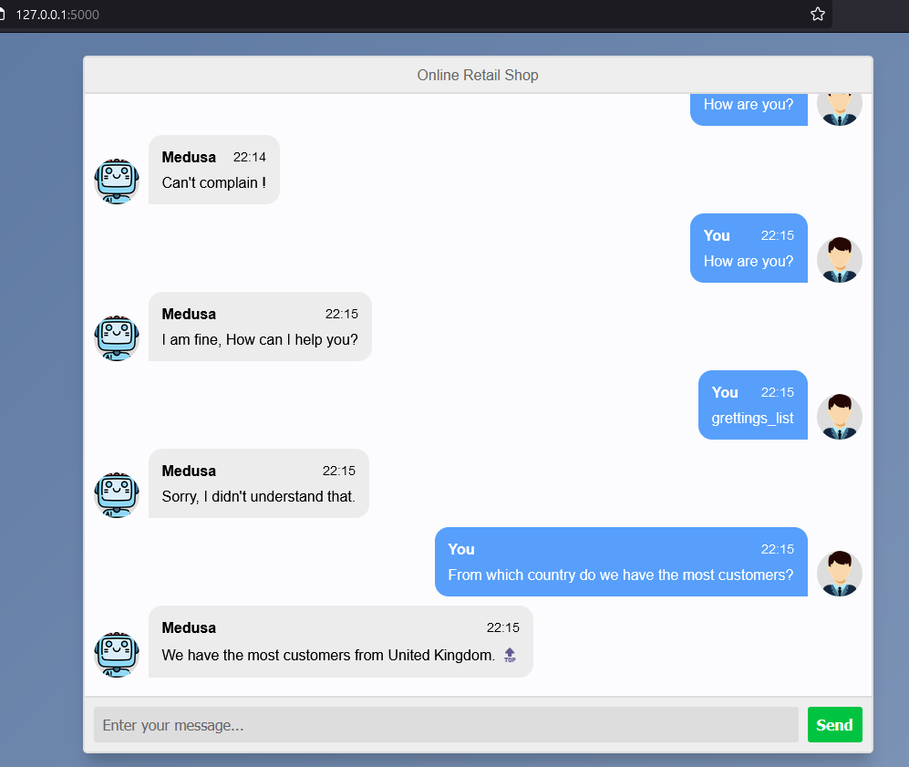

# Brainstation23-ML-Engineer-Test

Task1 is straing forwar. Here is the instruction for Task2:

it takes time to develop a bot.... 3 days not enough.

IDEA: 

1. Connecting ChatGPT and Langchain ans Database would be best for perfomance
2. We can use RASA framework

Instruction to run the app:

1. import SQL Database: Go to MySQL directory find Online Retail Data Set.sql. I'm using mysql community on windows. 
You can import the database according the screenshot on the same directory - import data.png

2. install required modules using requirements.txt : pip install -r requirements.txt

3. edit the database.py file change database username, pass .......

4. command: python main.py  to run the application

Note: The bot is mostly hardcoded

No documentation